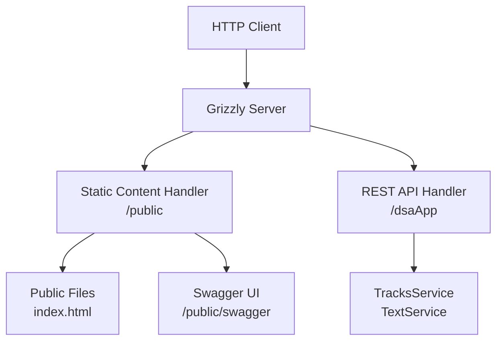
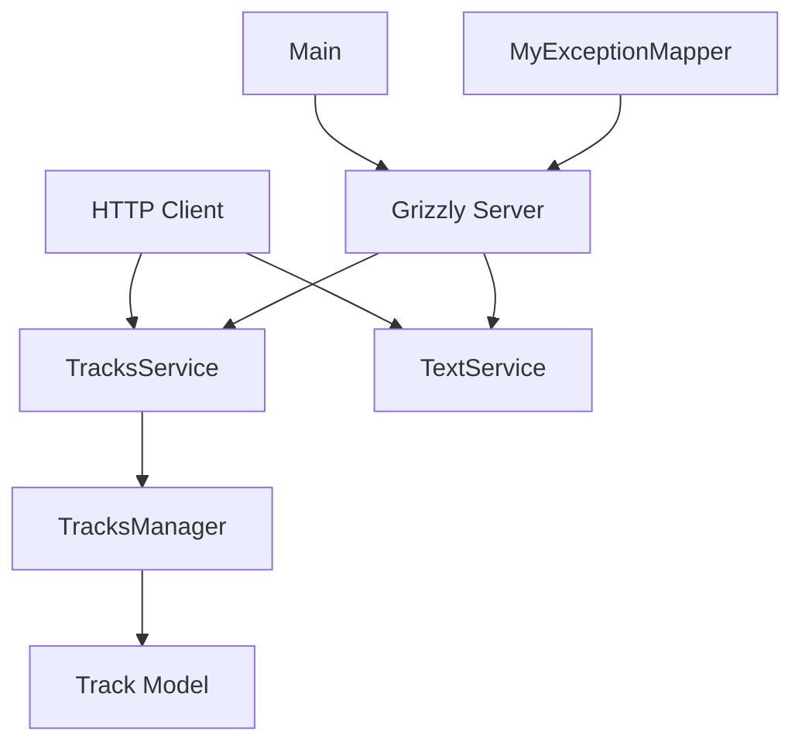

# rest-example

This project is a REST API example for managing music tracks. It is built with Java using Jersey for REST services, Grizzly as the HTTP server, and Swagger for API documentation.
## Part I
En aquesta part he implementat les qüestions bàsiques del mínim. He de mencionar que com a id de vols i avions he ficat F1, F2,... i P1, P2,P3... en comptes de en els vols ficar els identificadors de vols normals als aeroports com VTXXX perquè aixì em resultava més intuitiu.
Com a id de persones per les maletes, he ficat noms.
### Funcions implementades
    - afegir avions
    - consultar avions per id
    - afegir vols
    - consultar vols per id
    - facturacio de maletes en checkInLuggage
    - consulta de maletes per vol
    - netejar dades amb clears
    - tests basics per comprovar

### Errors detectats
    - en aquest punt de part I finalitzada, no funciona el REST perquè tinc reciclada la del exemple que vaig realitzar de Llibreria, pero ho arreglaré més tard en la part II, on ja explicare els canvis fets
    - tenia errors de compilacions en FlightManagerImpl perquè utilitzava luggagesbyFlight quan en realitat la B havia de ser majuscula
    - també tenia un bug amb ordre incorrecte de origin i destination, pero gràcies a la compilació del copilot ho he pogut detectar

## Part II
En aquesta part he implementat la capa REST del projecte a travez de la classe 'FlightsService', connectant els endpoints HTTP amb el FlightManager
### Funcionalidades implementadas
    - ja he netejat el REST del anterior minim que tenia pujat com a base
    - es poden crear avions mitjançant POST /flights/planes
    - podem consultar avions mitjançant GET /flights/planes/{id}
    - es poden crear vols mitjançant POST /flights
    - podem consultar vols amb GET /flights/{id}
    - podem facturar maletes en un vol amb POST /flights/{flightId}/luggages
    - podem consultar maletes associades a un vol amb GET /flights/{flightId}/luggages
    - eliminació de dades en memòria
    - en aquesta part m'he ajudat de la IA en moments puntuals per poder implementar-ho, a més de que partia com ja he dit de la base de la llibreria

### Errors trobats
    - els endpoints serveixen per consultar dades especifiques, però no donen llistes completes dels vols, maletes o avions. no és un error com a tal pero no està implementat

### base URI

http://localhost:8080/dsaApp/

### endpoints
    - `http://localhost:8080/dsaApp/flights/F1`
    - `http://localhost:8080/dsaApp/flights/planes/P1`
    - `http://localhost:8080/dsaApp/flights/F1/luggages`

## High-Level Server Structure

## Main Architecture

### Main Components:
- **TracksService**: REST service that exposes endpoints to manage tracks (GET, POST, etc.).
- **TextService**: Simple REST service for text responses.
- **TracksManager**: Interface and implementation for the business logic of track management.
- **Track**: Data model representing a music track.
- **MyExceptionMapper**: Exception mapper to handle API errors.
- **TrackNotFoundException**: Custom exception for tracks not found.
